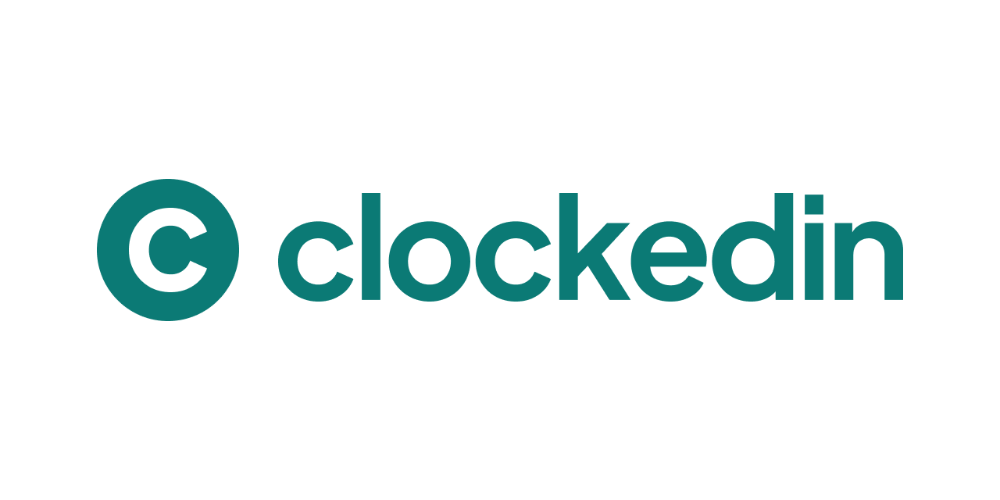

# clockedin



_clockedin_ is a job-search workspace designed to make finding and applying for work more organised, focused and manageable.

It brings together the information that is usually scattered across job boards, spreadsheets, notes, CV files and email, such as saved jobs, applications, application history, profile information and application documents.

_clockedin_ also includes AI-assisted job analysis and document generation. Generated CVs and cover letters are grounded in the user's profile and job details, with validation and editing built into the document workflow.

## Features

### Job Search Management

- Save jobs you're interested in
- Record company, role, location, employment type, salary, source, deadline and contact details
- Convert saved jobs into applications
- Track application status and dates
- Record follow-ups and next steps
- Maintain an application history for each opportunity
- Add notes throughout the search

### Personal Profile

- Maintain a central profile for your job search
- Store experience, education, skills, projects, links and career profiles
- Track profile completeness
- Reuse profile information across application documents
- Update profile information independently of individual applications

### AI-Assisted Documents

- Analyse job descriptions
- Select relevant experience and skills from the user's profile
- Generate tailored CVs
- Generate tailored cover letters
- Validate generated CV content against profile information
- Render generated documents as PDFs
- Edit generated CVs and cover letters before using them
- Store generated document versions against applications

AI is designed as an assistive layer rather than an authority. Generated content can contain mistakes and should be reviewed and edited by the user before being used.

## Core Workflow

```text
Create profile
     ↓
Save jobs
     ↓
Add applications
     ↓
Track status, follow-ups and next steps
     ↓
Analyse a job
     ↓
Generate a tailored CV / cover letter
     ↓
Review and edit
     ↓
Apply
```

## Tech Stack

| Area | Technology |
|---|---|
| Frontend | Angular 22 |
| Language | TypeScript |
| Styling | SCSS |
| UI | Bootstrap classes + custom design system |
| Authentication | Firebase Authentication |
| Database | Cloud Firestore |
| AI | Firebase AI Logic + Google Gemini |
| Local AI | WebLLM + Transformers.js |
| Client-side ML | Transformers.js / MiniLM embeddings |
| PDF generation | Typst-based document templates |
| Markdown | ngx-markdown |
| Reactive/state utilities | RxJS + Angular services |
| Application protection | Firebase App Check + reCAPTCHA Enterprise |
| Hosting | Firebase Hosting |

## Architecture

_clockedin_ is structured as an Angular application with feature-oriented modules and shared application infrastructure.

```text
src/app/
├── core/
│   ├── auth/                 # Authentication and route guards
│   └── firebase/             # Firebase initialisation
│
├── features/
│   ├── applications/         # Application list and detail views
│   ├── auth/                 # Sign up, sign in, verification, recovery
│   ├── dashboard/            # Job-search overview
│   ├── documents/            # AI generation, editors, PDFs and documents
│   ├── home/                 # Public landing page
│   ├── jobs/                 # Saved jobs and job details
│   ├── onboarding/           # Initial profile setup
│   ├── profile/              # User profile and career information
│   └── settings/             # Account settings
│
└── shared/
    ├── layout/               # Application, auth and public shells
    └── ui/                   # Reusable UI components
```

### Data Model

User-specific data is stored under the authenticated user's Firestore document.

```text
users/{userId}
├── info
├── career
│   ├── experience[]
│   ├── education[]
│   ├── projects[]
│   ├── skills[]
│   └── careerProfiles[]
├── templates
├── onboardingComplete
└── aiConsentAt

users/{userId}/jobs/{jobId}
├── job details
├── application details
├── jobUpdates[]
├── jobAnalysis
├── generatedCv
└── generatedCoverLetter

users/{userId}/jobs/{jobId}/generatedDocuments/{documentId}
└── generated document versions
```

The application accesses Firestore through repository services rather than coupling feature components directly to database operations.

## AI Architecture

The AI layer is provider-based so that generation capabilities are not tightly coupled to a single model provider.

The current architecture supports:

- **Firebase Gemini provider** for cloud generation
- **WebLLM provider** for local, browser-based generation
- **Transformers.js utilities** for local analysis tasks such as embeddings, keyword extraction, semantic similarity and skill matching

AI capabilities are represented explicitly, including:

- Job analysis
- Evidence selection
- CV generation
- Cover-letter generation

The AI service can determine which processing options are available and select an appropriate provider for a task.

### Data Handling and Consent

Before a user first generates a CV or cover letter, _clockedin_ presents an AI-processing consent message based on the providers currently available.

Depending on the available provider configuration, processing may occur:

- Locally on the user's device, without sending the data to an AI provider
- Through Google Gemini
- Through a hybrid path where local processing is used where possible and Gemini is used when local processing is unavailable or insufficient

The user can edit generated documents before using them.

### Grounding and Validation

Generated documents are designed to use information already present in the user's profile and job details.

The document generation pipeline includes structured schemas, provider-specific generation tasks and validation for generated CV content. The goal is to reduce unsupported claims rather than treat model output as authoritative.

## Authentication

_clockedin_ uses Firebase Authentication with an email/password flow.

The application includes:

- Account creation
- Email verification
- Sign in
- Password recovery
- Password changes
- Account deletion
- Authentication and guest route guards
- Onboarding completion checks

## Getting Started

### Prerequisites

You will need:

- Node.js
- npm
- A Firebase project
- Firebase Authentication configured
- Cloud Firestore configured
- Firebase AI Logic configured if using Gemini generation
- A reCAPTCHA Enterprise site key for App Check

### Installation

Clone the repository and install its dependencies:

```bash
npm install
```

### Environment Configuration

Firebase configuration is provided through Angular environment files.

The Firebase web configuration includes values such as:

```ts
export const environment = {
  apiKey: '...',
  authDomain: '...',
  projectId: '...',
  storageBucket: '...',
  messagingSenderId: '...',
  appId: '...',
  measurementId: '...',
  production: false,
  recaptchaEnterpriseSiteKey: '...',
};
```

The development App Check flow also supports a local debug token through:

```text
VITE_FIREBASE_APPCHECK_DEBUG_TOKEN
```

Do not commit development secrets, debug tokens, service-account credentials, or other private credentials to source control.

Firebase web API configuration values are not treated as application secrets. Access should instead be controlled through Firebase configuration, App Check, authentication, Firestore Security Rules and appropriate API restrictions.

### Firebase Configuration

Create the appropriate Angular environment configuration for your Firebase project.

At minimum, provide:

- Firebase project configuration
- reCAPTCHA Enterprise site key
- Any local App Check configuration required for development

Make sure the Firebase project has the services required by the features you intend to use.

## Development

Start the Angular development server with:

```bash
ng serve
```

Then open:

```text
http://localhost:4200/
```

The application reloads automatically when source files change.

## Building

Create a development build with:

```bash
ng build
```

Angular outputs the compiled application to the `dist/` directory.

For a production build:

```bash
ng build --configuration production
```

## Testing

Unit tests use the Angular/Vitest test setup included by the project:

```bash
ng test
```

If an end-to-end testing framework is configured in the local repository, run its configured command as appropriate.

## Deployment

_clockedin_ is designed to be deployed to Firebase Hosting.

The production architecture consists of:

```text
Angular production build
        ↓
Firebase Hosting
        ↓
Firebase Authentication
Cloud Firestore
Firebase AI Logic
App Check
```

For CI/CD deployments, Firebase credentials should be supplied through the CI provider's secret management rather than committed to the repository.

If separate staging and production Firebase projects are used, keep their environment configuration and deployment credentials isolated.

Firebase Storage is not required by the current MVP architecture.

## Project Conventions

### Feature-First Structure

Application code is organised around product features rather than technical layers alone. A feature owns its pages, models, state and data access where practical.

Shared components belong under:

```text
src/app/shared
```

Cross-cutting infrastructure such as authentication and Firebase initialisation belongs under:

```text
src/app/core
```

### Repository-Based Data Access

Firestore access is encapsulated in repository services such as:

- `ProfileRepository`
- `JobRepository`
- `DocumentRepository`
- `AiUsageRepository`

This keeps database concerns separate from the UI and makes the feature layer easier to evolve.

### AI Capabilities

AI tasks are represented as explicit capabilities rather than scattered model calls. This allows providers to be swapped or expanded without changing the higher-level document workflow.

## Design Principles

_clockedin_ aims to make a complicated process feel manageable.

### Clear Over Clever

The interface uses familiar job-search language instead of exposing internal implementation concepts.

### Calm Over Cluttered

The product is designed to reduce the cognitive load of managing a job search rather than turn it into another dashboard to maintain.

### Structured Enough to Trust

Profile and application data is structured so that it can support useful automation without requiring the user to understand the underlying data model.

### AI as an Assistant

AI can help analyse jobs and prepare documents, but the user remains responsible for reviewing and editing the result.

### User-Owned Context

The user's profile is the foundation for application documents, allowing information to be reused rather than repeatedly entered from scratch.

## Future Directions

The architecture leaves room for future work around:

- [ ] Additional AI providers and more local processing
- [ ] More sophisticated job analysis
- [ ] Additional document templates
- [ ] Broader job-board and productivity integrations
- [ ] Improved application insights
- [ ] More advanced search and filtering
- [ ] Additional authentication and account integrations

## Project Status

The project remains under active development, with the architecture intentionally designed to support additional capabilities without changing the core job-search workflow.

## License

_clockedin_ is source-available for demonstration and portfolio purposes.

The source code is publicly viewable, but it is not licensed for general reuse, modification, distribution, or commercial use. All rights are reserved by the copyright holder unless otherwise stated.

You may view and reference the repository as permitted by GitHub's platform and Terms of Service, but public availability does not grant permission to reproduce or redistribute the software.

For permission to reuse any substantial portion of the code, please contact the copyright holder.
